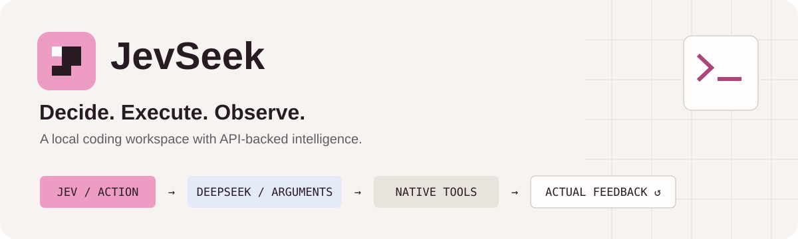
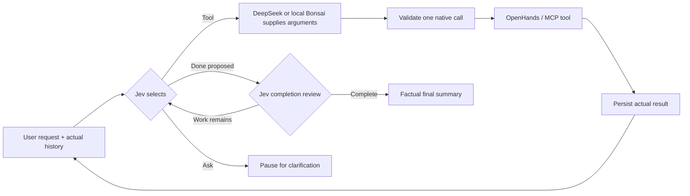

<div align="center">
  
  <br /><br />
  <strong>One action at a time. Real tools. Feedback that stays grounded.</strong>
  <br /><br />
  <a href="#what-it-does">Features</a> ·
  <a href="#quick-start">Quick start</a> ·
  <a href="RESEARCH.md">Research</a> ·
  <a href="docs/BACKEND.md">Architecture</a> ·
  <a href="SECURITY.md">Security</a>
</div>

<br />

## What is JevSeek?

**JevSeek is a desktop coding agent that separates choosing an action from writing its arguments.**
[TypeSafe/Jev](https://typesafe.ai/) selects the next tool, non-thinking
[DeepSeek](https://www.deepseek.com/) or optional local Bonsai supplies the arguments, and
[OpenHands](https://github.com/OpenHands/software-agent-sdk) executes the native tools.
The next decision uses what **actually happened**, rather than a speculative plan.

You get a React desktop workspace for conversations, live tool activity, saved
sessions and inspectable artifacts—with a CLI using the same backend.

> **Local tools, optional local generation.** Windows desktop Settings can download
> and run either Bonsai 2 27B model with one click, replacing DeepSeek.
> Jev still receives routing context and needs its API key; this is not fully offline.
> [Local model setup, requirements and privacy →](docs/LOCAL_MODELS.md)

## What it does

| Capability | What you get |
| :-- | :-- |
| **Work on real projects** | Read, write and edit files; run commands through OpenHands' native terminal. The `bash` tool uses PowerShell on Windows. |
| **See the work happen** | Actual tool calls, expandable output, errors and compaction notices—not fabricated progress. |
| **Continue a conversation** | Persistent history, follow-up tasks and offline viewing. Opening a completed session never replays its effects. |
| **Keep context grounded** | Pinned user requests, recent source snapshots, deterministic compaction and links to full local output. |
| **Connect MCP tools** | Register trusted HTTP/SSE/stdio servers, inspect the connection and enable them for a new run. |
| **Choose local generation** | One-click Prism Bonsai 2 or community CRACK setup, resumable download progress, integrity checks and automatic NVIDIA/CPU runtime selection. |
| **Manage your keys** | First-run setup and Settings controls backed by Windows Credential Manager. No keys bundled in the app. |
| **Make it comfortable** | Light/dark/system themes, bundled fonts, keyboard controls, responsive navigation and reduced-motion support. |

The **Files** screen shows saved session artifacts; it is not a general filesystem explorer.
There are no subagents, synthetic-thinking gates or dedicated planning tools in the runtime.

## How it works



**The boundary is deliberate:** Jev chooses the action; the generation model cannot silently
switch to another tool. Arguments are validated before effects. Incomplete calls
do not execute. Interrupted effects require review rather than automatic replay.

**v0.2.1 hotfix:** follow-ups retain the previous assistant response as conversation,
not execution evidence. A separate Jev completion review catches premature `done`
decisions and sends unfinished work back to tool selection. Pure conversation does
not require a tool call. See [completion policy and limits](docs/BACKEND.md#completion-hotfix-v021).

Context compaction is deterministic—not another model's generated summary. Earlier
requests remain pinned except for credential redaction; oversized pinned context
pauses visibly instead of silently dropping requirements.

[Backend contract →](docs/BACKEND.md) · [Desktop architecture →](docs/DESKTOP.md)

## Quick start

### Desktop from source

Use **Python 3.12**, **Node 24** (tested), and Windows with WebView2 installed.
The standalone Windows build bundles Python, dependencies and WebView2 instead.
Native macOS/Linux packaging has not been validated.

```powershell
git clone https://github.com/morcoan/JevSeek.git
cd JevSeek
python -m venv .venv
.venv\Scripts\Activate.ps1
python -m pip install -r requirements.txt -c requirements.lock
python -m pip install -r requirements-desktop.txt -c requirements-desktop.lock
cd frontend
npm ci
npm run build
cd ..
python desktop.py
```

Add your **DeepSeek** and **TypeSafe/Jev** keys in the app, choose a workspace and
send a task. Saving a key does not call a provider or spend credits. Settings lets
you replace/remove keys without restarting; changes are blocked during a run.

<details>
<summary><strong>Prefer the CLI?</strong></summary>

Install the core Python dependencies above. Copy `.env.example` to `.env` only if
you do not already have one, then set `DS_KEY` and `JEV_KET` (the latter is an
intentional compatibility spelling; `TYPESAFE_API_KEY` also works).

```sh
python main.py --workspace /path/to/project "Fix the failing tests"
python main.py --list
python main.py --session SESSION_ID "Add an edge-case test"
python main.py --session SESSION_ID --compact
```

`--compact` without a prompt is local-only. Reopening a completed session without
a prompt returns its saved answer. See the [source and CLI guide](docs/USAGE.md)
for configuration, MCP setup and interrupted-run handling.

</details>

### Standalone Windows EXE

Download the unsigned Windows x64 EXE from the [latest release](https://github.com/morcoan/JevSeek/releases/latest).
A single-file Windows x64 build is also supported: `release/JevSeek.exe` after building.
It includes Python, the frontend/fonts and Fixed Version WebView2. Project-specific
tools such as Git, Node, Python interpreters for your projects, or MCP servers are
**not** bundled. Build outputs are not committed to this repository.

The tested build is **unsigned**. First launch asks you to review Microsoft's
runtime terms, then configure your keys. Personal state lives under
`%LOCALAPPDATA%\JevSeek`; the EXE does not load a neighboring `.env` or `mcp.json`.

[Build the EXE →](docs/RELEASE.md) · [Desktop controls →](docs/DESKTOP.md)

## Research that shaped the design

JevSeek grew out of local experiments, including configurations that **did not
work**. The implementation follows the evidence observed—not a claim of universal
agent superiority.

| Question | What was observed | Decision |
| :-- | :-- | :-- |
| Does a model-written plan help routing? | Small pilots tied on clear requests; an injected wrong plan redirected one otherwise clear choice. | Keep speculative plans out of routing state. |
| Decide as you go, or freeze all tools in advance? | On one build-engine task, JIT passed **30/30** tests; two frozen linear schedules passed **1/30**. | Select the next action after real feedback. |
| Native reasoning, synthetic deliberation, or plain arguments? | On that task, plain and native-max each passed **30/30**; synthetic v2 halted at **11/30**. | Use plain non-thinking arguments; keep deliberation experimental. |
| Does that survive production context handling? | A separate backend run passed **30/30** with **10 actions** and **3 automatic compactions**. | Retain factual source context and inspectable session artifacts. |

**Important limits:** these are small local studies, not a broad benchmark suite.
All main comparison arms used Jev; there is **no Jev-vs-DeepSeek-router ablation**.
Provider load, cache behavior and model aliases can change. Test success is not a
security guarantee, and an unfinished run is not a performance win.

### [Read the research breakdown →](RESEARCH.md)

Methods, numbers, failures, limitations and reproduction commands are documented
there. Benchmark source and evaluator fixtures are public; raw personal sessions,
traces and generated workspaces are deliberately excluded.

## Verification

Recorded local validation includes:

- **82 Python tests** across backend, MCP, desktop, credentials and publication checks.
- **10 research regression tests** and **8 frontend state tests**.
- **19 core UI screens + 5 key/terms screens** with zero reported axe A/AA violations
  and console errors in their recorded audits—not a human screen-reader certification.
- An isolated EXE check with Python/Node removed from PATH: real vault save/remove,
  file read/write/edit, PowerShell, bundled WebView2 and MCP-helper execution.
- A source-desktop, real-provider read-only integration check. This is separate from
  the offline EXE check and is not a model-quality benchmark.

These are recorded checks, **not a claim that hosted CI is running**.

```sh
python -m unittest -v test_credentials.py test_public_audit.py test_desktop.py test_backend.py test_mcp_setup.py
python -m unittest discover -s benchmarks -p test_deliberation.py -v
cd frontend
npm test
npm run build
```

## Security & limits

- **Not a sandbox.** Tools have your account's privileges. Use trusted projects and
  MCP servers, or an isolated OS account/VM. Do not run as administrator.
- **Protect your history.** Sessions may contain private code/output despite
  best-effort redaction. Do not upload them in bug reports.
- **Stop is cooperative.** Native calls can take time to return; a stopped process
  does not prove a tool had no effects.
- **API-backed inference.** Provider billing/privacy terms apply. Microsoft WebView2
  and SmartScreen also have disclosed network/privacy behavior.
- **Keep the runtime current.** Bundled Fixed WebView2 does not auto-update;
  maintainers must ship updates. Windows 11 is verified; fresh-VM certification and
  independent security review have not been performed.

[Security policy →](SECURITY.md) · [Third-party notices →](docs/THIRD_PARTY.md)

## Explore the repository

```text
jevseek/       Agent loop, context, sessions, native tools and desktop bridge
frontend/      React + TypeScript + CSS desktop interface
benchmarks/    Experimental runners and the independent build-engine evaluator
research/      Historical routing study and production-context findings
docs/          Architecture, usage, desktop and release documentation
scripts/       Build, validation and privacy-safe export helpers
packaging/     Windows executable spec, icon and runtime version pin
```

Before contributing, run the relevant tests and
`python scripts/public_audit.py --history`. Never commit `.env`, machine MCP
configuration, agent memory, sessions or build outputs. Keep runtime changes
separate from research experiments and label billable tests explicitly.

**License:** JevSeek's own source is licensed under the [MIT License](LICENSE).
Dependencies retain their
[respective licenses](docs/THIRD_PARTY.md). JevSeek is an independent project, not
an official DeepSeek, TypeSafe or OpenHands product.
